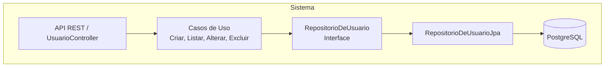

## Modelo de Arquitetura C4

### C4Context

- Person(client, "Cliente", "Consumidor da API REST")
- System(api, "codechella API", "Backend Spring Boot")
- SystemDb(db, "Banco de Dados", "PostgreSQL")
- Rel(client, api, "usa")
- Rel(api, db, "persiste dados em")