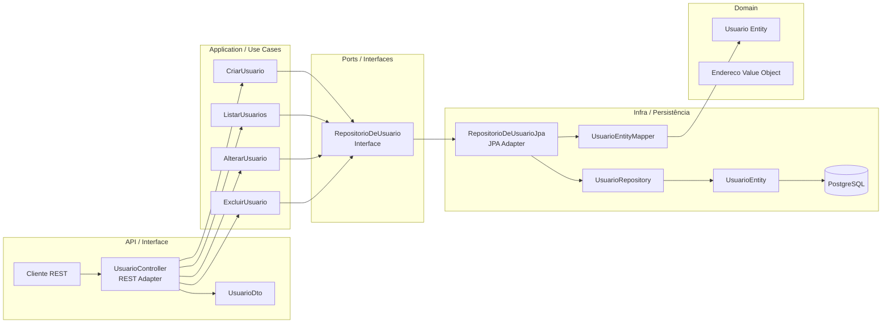
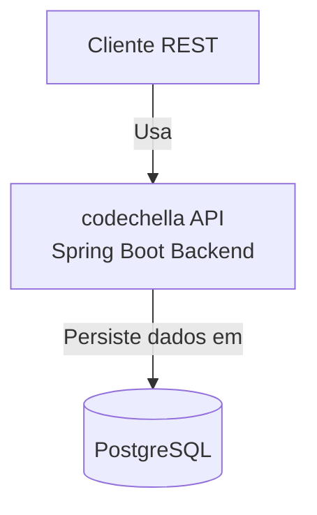
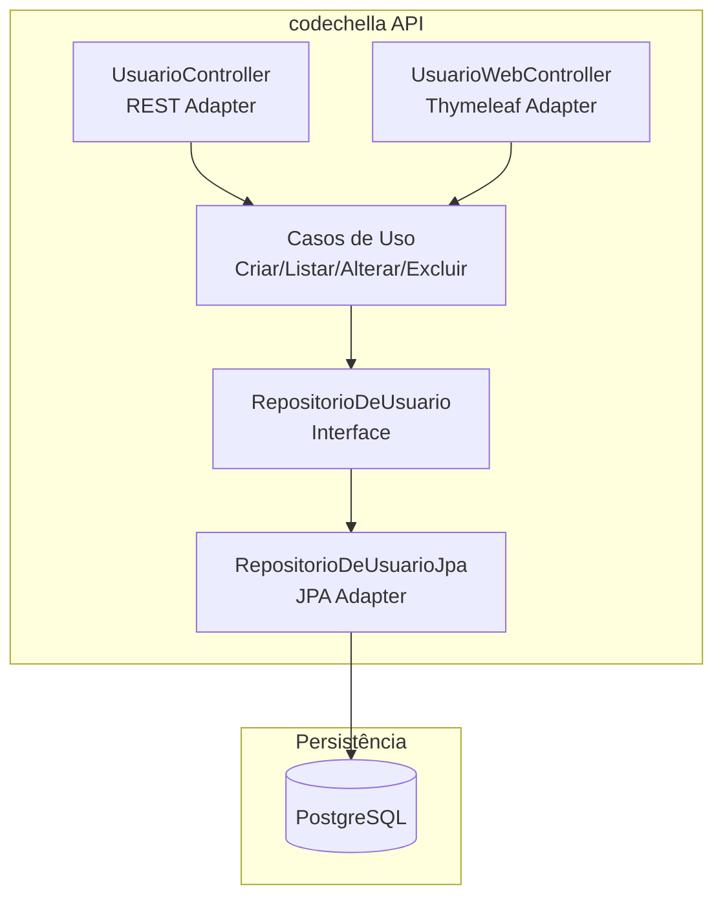
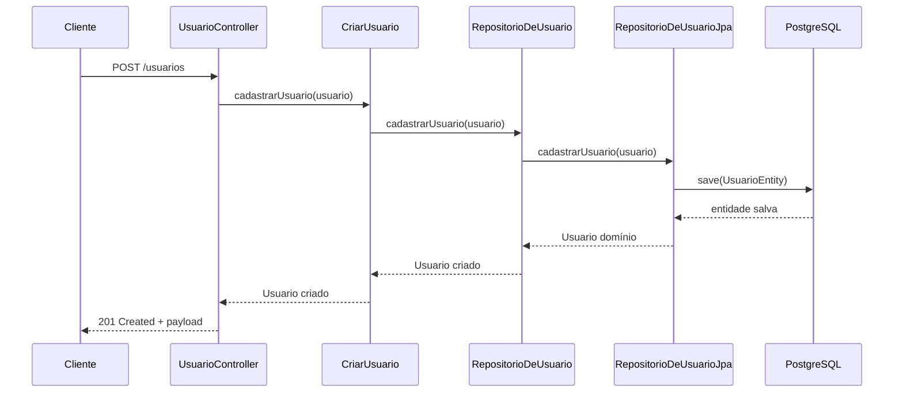
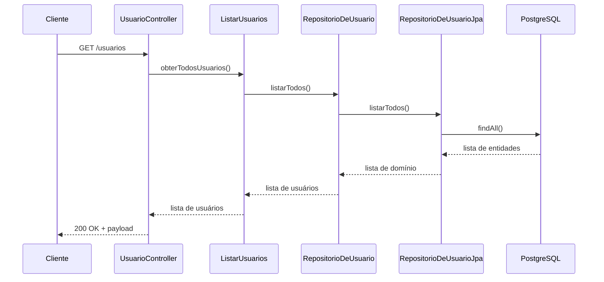
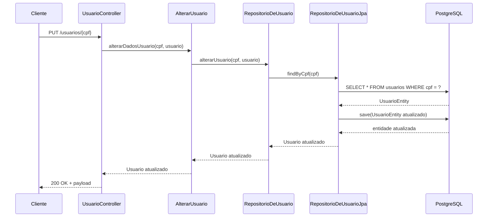
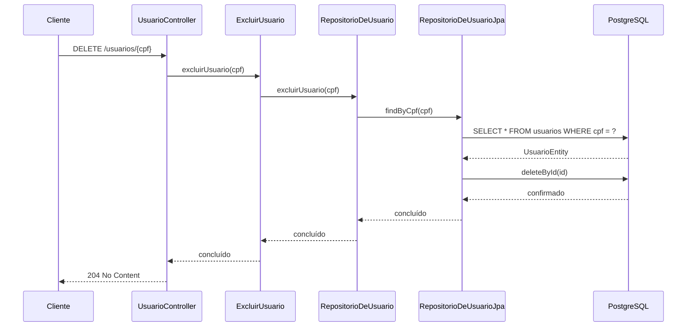
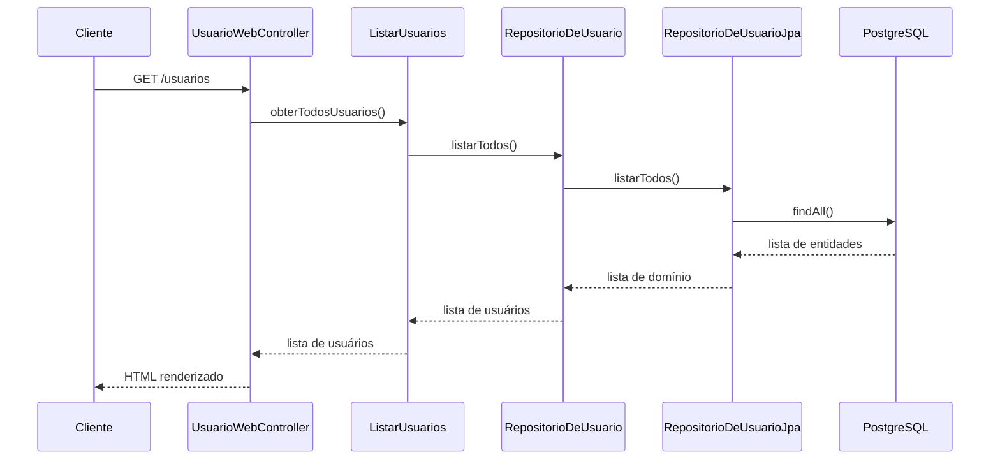
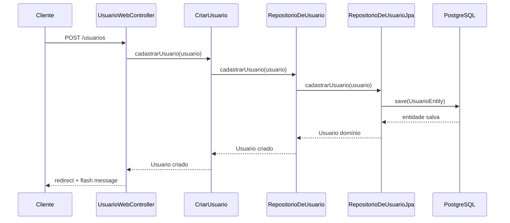
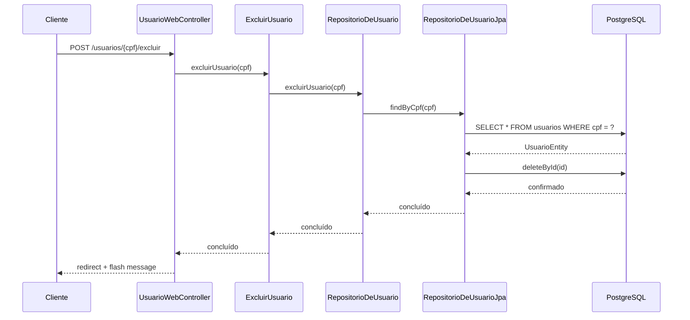

# Especificação de Arquitetura Atual

## Visão Geral

Este documento descreve a arquitetura atual do projeto `codechella` usando a abordagem OpenSpec. O objetivo é mapear a estrutura de pacotes, os principais componentes, entidades, casos de uso implementados e as tecnologias em uso.

## Objetivo

- Documentar a arquitetura atual em um formato legível e reutilizável.
- Identificar claramente os limites entre Domain, Use Cases, Adapters e Infrastructure.
- Descrever os principais fluxos de dados, entidades e integrações tecnológicas.

## Escopo

Inclui:
- pacotes de domínio (`domain`);
- casos de uso (`application/usecases`);
- portas e adaptadores (`application/gateways`, `infra/controller`, `infra/gateways`);
- interface web server-side com Thymeleaf (`infra/controller/web`, `templates`);
- persistência JPA (`infra/persistence`);
- configuração de injeção de dependências (`config/UsuarioConfig.java`);
- tecnologia e runtime do projeto.

## Arquitetura Geral

O projeto segue uma variação de Clean Architecture / hexagonal, com camadas claramente separadas:

- `br.com.alura.codechella.domain`: núcleo de domínio rico em regras de negócio.
- `br.com.alura.codechella.application.usecases`: orquestração de casos de uso e regra de aplicação.
- `br.com.alura.codechella.application.gateways`: portas de entrada/saída abstratas para o repositório.
- `br.com.alura.codechella.infra.controller`: adaptadores de API REST.
- `br.com.alura.codechella.infra.controller.web`: adaptadores web server-side com Thymeleaf.
- `br.com.alura.codechella.infra.gateways`: adaptadores de persistência.
- `br.com.alura.codechella.infra.persistence`: entidades JPA e repositório Spring Data.
- `br.com.alura.codechella.config`: configuração de beans Spring para a composição das dependências.

## Diagrama de Componentes



## Modelo de Arquitetura C4

### C4 - Contexto



### C4 - Containers



## Diagramas de Sequência

### Criar Usuário



### Listar Usuários



### Atualizar Usuário



### Excluir Usuário



### Navegar pela interface web



### Cadastrar pela interface web



### Excluir pela interface web



## Resumo do Diagrama

Esta seção visualiza:

- o fluxo de componentes entre API, casos de uso, porta de repositório e adaptador JPA;
- um modelo C4 de contexto e containers que mostra o sistema `codechella API` e seu banco PostgreSQL;
- os fluxos de sequência para criar, listar, alterar e excluir usuário.

## Exemplos de Chamadas REST com curl

Os exemplos abaixo usam o payload de usuário do arquivo `usuarios.txt` e mostram como interagir com a interface web em `/usuarios` e com a API REST em `/api/usuarios`.

### Interface Web

```bash
curl -i http://localhost:8080/usuarios
```

```bash
curl -i http://localhost:8080/usuarios/novo
```

```bash
curl -i -X POST http://localhost:8080/usuarios \
  -H 'Content-Type: application/x-www-form-urlencoded' \
  --data-urlencode 'nome=Maria' \
  --data-urlencode 'cpf=789.456.132-25' \
  --data-urlencode 'nascimento=2000-10-15' \
  --data-urlencode 'email=maria@mail.com'
```

```bash
curl -i http://localhost:8080/usuarios/789.456.132-25/editar
```

```bash
curl -i -X POST http://localhost:8080/usuarios/789.456.132-25 \
  -H 'Content-Type: application/x-www-form-urlencoded' \
  --data-urlencode 'nome=Maria Atualizada' \
  --data-urlencode 'cpf=789.456.132-25' \
  --data-urlencode 'nascimento=2000-10-15' \
  --data-urlencode 'email=maria@mail.com'
```

```bash
curl -i http://localhost:8080/usuarios/789.456.132-25/excluir
```

```bash
curl -i -X POST http://localhost:8080/usuarios/789.456.132-25/excluir
```

### API REST

### Criar Usuário

```bash
curl -X POST http://localhost:8080/api/usuarios \
  -H "Content-Type: application/json" \
  -d '{
    "cpf": "789.456.132-25",
    "nome": "Maria",
    "nascimento": "2000-10-15",
    "email": "maria@mail.com"
  }'
```

### Listar Usuários

```bash
curl -X GET http://localhost:8080/api/usuarios
```

### Atualizar Usuário

```bash
curl -X PUT http://localhost:8080/api/usuarios/789.456.132-25 \
  -H "Content-Type: application/json" \
  -d '{
    "cpf": "789.456.132-25",
    "nome": "Joao",
    "nascimento": "2000-10-15",
    "email": "joao@mail.com"
  }'
```

### Excluir Usuário

```bash
curl -X DELETE http://localhost:8080/api/usuarios/789.456.132-25
```

## Como usar

- Abra o preview Markdown no VS Code para renderizar os diagramas Mermaid.
- Em ferramentas que suportam Mermaid, os diagramas serão exibidos automaticamente.
- Use essas visualizações para explicar a arquitetura para o time e apoiar decisões de design.

## Pacotes e Responsabilidades

### Domain

Localização: `src/main/java/br/com/alura/codechella/domain`

Responsabilidade:
- Definir os conceitos de domínio e as regras de validação de entidades.

Conteúdo principal:
- `Endereco`: valor de objeto que representa o endereço de um usuário.
- `Usuario`: entidade de domínio com campos `cpf`, `nome`, `nascimento`, `email` e `endereco`.
  - Validação de CPF no construtor, exigindo o padrão `\d{3}\.\d{3}\.\d{3}\-\d{2}`.

### Use Cases

Localização: `src/main/java/br/com/alura/codechella/application/usecases`

Responsabilidade:
- Orquestrar as operações do sistema usando as portas da camada de domínio.
- Delegar persistência para implementações concretas de `RepositorioDeUsuario`.

Casos de uso implementados:
- `CriarUsuario`: cadastra um novo usuário via `RepositorioDeUsuario.cadastrarUsuario`.
- `ListarUsuarios`: retorna todos os usuários via `RepositorioDeUsuario.listarTodos`.
- `AlterarUsuario`: atualiza dados de usuário existente via `RepositorioDeUsuario.alterarUsuario`.
- `ExcluirUsuario`: remove usuário via `RepositorioDeUsuario.excluirUsuario`.

### Application Gateways

Localização: `src/main/java/br/com/alura/codechella/application/gateways`

Responsabilidade:
- Definir contrato de persistência para `Usuario`.

Interface:
- `RepositorioDeUsuario`
  - `cadastrarUsuario(Usuario usuario)`: persiste usuário.
  - `listarTodos()`: lista todos os usuários.
  - `alterarUsuario(String cpf, Usuario usuario)`: altera usuário existente.
  - `excluirUsuario(String cpf)`: exclui usuário.

### Adapters - Interface Externa / API

Localização: `src/main/java/br/com/alura/codechella/infra/controller`

Responsabilidade:
- Expor endpoints REST para clientes.
- Converter entre DTOs e entidades de domínio.

Componentes:
- `UsuarioController` expõe os endpoints:
  - `POST /api/usuarios` para criar usuário;
  - `GET /api/usuarios` para listar todos;
  - `PUT /api/usuarios/{cpf}` para atualizar usuário;
  - `DELETE /api/usuarios/{cpf}` para excluir usuário.
- `UsuarioDto`: DTO usado como payload de entrada e saída.

### Adapters - Interface Externa / Web

Localização: `src/main/java/br/com/alura/codechella/infra/controller/web`

Responsabilidade:
- Expor rotas web server-side para navegação pelo CRUD de usuários.
- Renderizar templates Thymeleaf com listagem, formulário e confirmação de exclusão.

Componentes:
- `UsuarioWebController` expõe as rotas:
  - `GET /usuarios` para listar todos;
  - `GET /usuarios/novo` para exibir cadastro;
  - `POST /usuarios` para criar usuário;
  - `GET /usuarios/{cpf}/editar` para exibir edição;
  - `POST /usuarios/{cpf}` para atualizar usuário;
  - `GET /usuarios/{cpf}/excluir` para confirmar exclusão;
  - `POST /usuarios/{cpf}/excluir` para excluir usuário.
- `UsuarioForm`: objeto de formulário com mapeamento para `Usuario`.

### Adapters - Persistência

Localização: `src/main/java/br/com/alura/codechella/infra/gateways`

Responsabilidade:
- Implementar a interface de persistência do domínio com JPA.
- Mapear entre entidade de domínio e entidade de persistência.

Componentes:
- `RepositorioDeUsuarioJpa`: implementação de `RepositorioDeUsuario`.
  - `cadastrarUsuario`: mapeia `Usuario` para `UsuarioEntity`, salva e retorna o domínio.
  - `listarTodos`: obtém todos os `UsuarioEntity` e mapeia para `Usuario`.
  - `alterarUsuario`: busca por CPF, mantém o mesmo id e salva o registro atualizado.
  - `excluirUsuario`: localiza a entidade por CPF e exclui por id.
- `UsuarioEntityMapper`: converte entre `Usuario` e `UsuarioEntity`.

### Infraestrutura de Persistência

Localização: `src/main/java/br/com/alura/codechella/infra/persistence`

Responsabilidade:
- Definir a representação de banco de dados e o repositório Spring Data.

Componentes:
- `UsuarioEntity`: entidade JPA mapeada para a tabela `usuarios`.
  - Campos: `id`, `cpf`, `nome`, `nascimento`, `email`.
- `UsuarioRepository`: `JpaRepository<UsuarioEntity, Long>` com método customizado `findByCpf(String cpf)`.

### Configuração e Composição

Localização: `src/main/java/br/com/alura/codechella/config/UsuarioConfig.java`

Responsabilidade:
- Registrar beans Spring para casos de uso e implementações de repositório.
- Vincular abstrações de domínio a adaptadores concretos.

Beans configurados:
- `CriarUsuario`, `ListarUsuarios`, `AlterarUsuario`, `ExcluirUsuario`.
- `RepositorioDeUsuarioJpa` como implementação de `RepositorioDeUsuario`.
- `UsuarioEntityMapper`.

## Fluxo de Dados Principal

1. O cliente faz requisição REST para `UsuarioController` ou navega pela interface web em `UsuarioWebController`.
2. O controller REST converte `UsuarioDto` em `Usuario` de domínio; o controller web converte `UsuarioForm` em `Usuario`.
3. O controller invoca o caso de uso correspondente (`CriarUsuario`, `ListarUsuarios`, `AlterarUsuario`, `ExcluirUsuario`).
4. O caso de uso chama `RepositorioDeUsuario`.
5. `RepositorioDeUsuarioJpa` executa a operação de persistência usando `UsuarioRepository`.
6. O resultado é convertido de volta para `UsuarioDto` no REST ou renderizado em templates Thymeleaf no fluxo web.

## Principais Entidades

### `Usuario`

- Representa o usuário do sistema.
- Possui atributos:
  - `cpf` (identificador lógico e válido no formato `XXX.XXX.XXX-XX`)
  - `nome`
  - `nascimento`
  - `email`
  - `endereco` (não persistido atualmente pela camada JPA)
- Contém lógica de validação de CPF no construtor.

### `Endereco`

- Representa o endereço de um usuário.
- Atributos:
  - `cep`
  - `numero`
  - `complemento`
- Atualmente não é usado pela camada de persistência e não é mapeado em `UsuarioEntity`.

### `UsuarioEntity`

- Entidade JPA mapeada para persistência.
- Atributos persistidos:
  - `id` (gerado automaticamente)
  - `cpf`
  - `nome`
  - `nascimento`
  - `email`
- Não inclui `endereco`.

## Casos de Uso Implementados

| Caso de Uso | Descrição | Classe |
|-------------|-----------|--------|
| Criar usuário | Persistir um novo usuário | `CriarUsuario` |
| Listar usuários | Recuperar todos os usuários | `ListarUsuarios` |
| Alterar usuário | Atualizar dados de um usuário existente por CPF | `AlterarUsuario` |
| Excluir usuário | Remover usuário por CPF | `ExcluirUsuario` |

## Tecnologias Utilizadas

- Java 17
- Spring Boot 3.2.2
- Spring Web
- Spring Thymeleaf
- Spring Data JPA
- PostgreSQL (dependência runtime)
- Hibernate
- Bean Validation (starter `spring-boot-starter-validation`)
- JPA com `jakarta.persistence`

### Configuração de Banco de Dados

- `spring.datasource.url=jdbc:postgresql://${DB_HOST:localhost:5432}/codechella_db`
- `spring.datasource.username=${DB_USER:postgres}`
- `spring.datasource.password=${DB_PASSWORD:Info@123}`
- `hibernate.dialect=org.hibernate.dialect.HSQLDialect`
- `spring.jpa.hibernate.ddl-auto=update`
- `spring.jpa.show-sql=true`
- `spring.jpa.format-sql=true`
- `server.port=8081`
- `server.port=8080` quando o profile `docker` estiver ativo

## Observações de Arquitetura

- A arquitetura está alinhada a um estilo de camadas limpas, com domínio isolado de detalhes de infraestrutura.
- A interface web Thymeleaf e a API REST compartilham os mesmos casos de uso, mas expõem rotas separadas.
- A camada de domínio ainda expõe a entidade `Endereco`, mas este objeto não está persistido nem mapeado em `UsuarioEntity`.
- A lógica de atualização do usuário depende de `cpf` para localizar o registro existente e atualiza o objeto inteiro, preservando o `id` original.
- O uso de DTOs no controller garante separação entre API e entidade de domínio.
- `UsuarioConfig` vincula concretamente `RepositorioDeUsuarioJpa` à interface `RepositorioDeUsuario`, permitindo inversão de dependência.

## Pontos de melhoria identificados

- `Endereco` não está persistido; se for requisito, é necessário estender `UsuarioEntity` e o mapeamento.
- `UsuarioDto` não contém `endereco`, gerando inconsistência entre modelo de domínio e API.
- A busca por usuário no repositório JPA assume que `findByCpf` sempre retorna entidade; há risco de `NullPointerException` se o CPF não existir.
- `Usuario` valida CPF, mas não valida email ou data de nascimento.
- A camada de persistência poderia tratar exceções e nulos de forma mais robusta.

## Considerações Finais

Este documento captura a arquitetura atual do projeto e serve como base para evolução ou modernização. Ele pode ser utilizado como ponto de partida para:

- criação de propostas de refatoração;
- adição de novos casos de uso;
- migração de persistência ou melhoria de testes.

---

**Documento gerado em:** 2026-05-19
**Autor:** OpenSpec / análise automática
